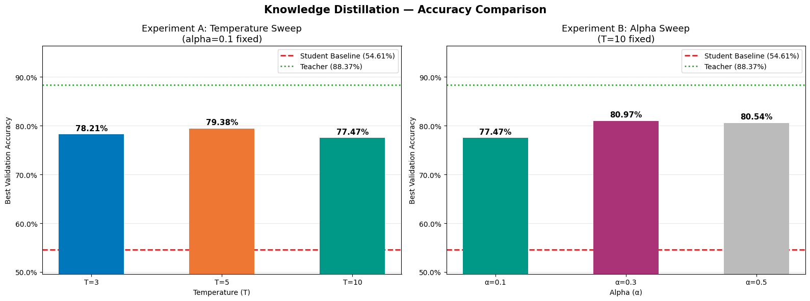
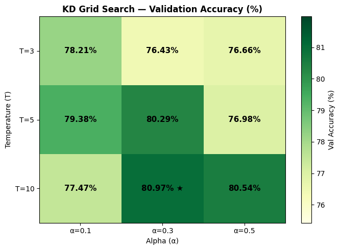

<div align="right">
  <strong>English</strong> | <a href="./README.ko.md">한국어</a>
</div>

# Knowledge Distillation for Traffic Sign Recognition

A TensorFlow computer-vision experiment that compresses a MobileNetV2 teacher into a 34K-parameter model for German Traffic Sign Recognition Benchmark (GTSRB) classification.

[Open the notebook](./notebooks/knowledge_distillation_gtsrb.ipynb) · [Read the technical report](./docs/knowledge-distillation-report.pdf) · [View on Kaggle](https://www.kaggle.com/code/dongmyungpark/gtsrb)

## Project snapshot

This project asks a practical model-compression question: how much accuracy can a very small convolutional network recover from a stronger pretrained model without adding inference-time complexity?

The experiment compares a MobileNetV2 teacher, an independently trained compact baseline, and nine distilled models. The distillation search covers three temperatures and three hard-label weights, then evaluates accuracy, parameter count, single-image latency, and class-level error patterns.

| Metric | Result |
| --- | ---: |
| Best distilled accuracy | **80.97%** |
| Compact baseline accuracy | 54.61% |
| Teacher accuracy | 88.37% |
| Accuracy gain over compact baseline | **+26.37 pp** |
| Teacher accuracy retained | **91.6%** |
| Parameter reduction vs. teacher | **67.2×** |
| Best configuration | `temperature=10`, `alpha=0.3` |

The distilled model keeps the same 34,406-parameter architecture and approximately the same measured latency as the compact baseline, so the improvement comes from the training signal rather than a larger deployment model.



## Experiment design

### Data

- GTSRB with 43 traffic-sign classes
- 39,209 training images and 12,630 evaluation images
- Images resized to 96 × 96 and normalized to `[0, 1]`
- Inverse-frequency class weights for class imbalance
- A fixed random seed for repeatability

### Models

- **Teacher:** ImageNet-pretrained MobileNetV2 with the final 60 backbone layers fine-tuned, global average pooling, dropout, and a 43-class output layer
- **Compact model:** three depthwise-separable convolution blocks followed by global average pooling and a small dense classifier
- **Model sizes:** 2,313,067 parameters for the teacher and 34,406 for the compact model

### Distillation objective

The compact model learns from both ground-truth labels and the teacher's temperature-scaled probability distribution:

```text
loss = alpha * hard_label_loss
     + (1 - alpha) * temperature^2 * distillation_loss
```

The notebook evaluates the Cartesian product of:

- Temperature: `3`, `5`, `10`
- Hard-label weight (`alpha`): `0.1`, `0.3`, `0.5`



## What the results show

- All nine distillation settings outperform the compact baseline by at least 21.82 percentage points.
- Temperature and `alpha` interact: tuning them jointly finds a 1.59-point improvement over the best result from the isolated temperature sweep.
- Speed-limit classes show stronger mean gains than the remaining classes (+33.11 pp vs. +23.44 pp), suggesting that soft targets are especially useful when visual similarity reflects meaningful class structure.
- A few directional-sign classes regress, showing that visually similar classes can also produce negative transfer when their meanings require sharply different predictions.

## Repository structure

```text
.
├── assets/
│   └── figures/                  # Portfolio-ready result visualizations
├── docs/
│   ├── knowledge-distillation-report.pdf
│   └── project-brief.pdf
├── notebooks/
│   └── knowledge_distillation_gtsrb.ipynb
├── README.md                     # English documentation
├── README.ko.md                  # Korean documentation
└── requirements.txt
```

The technical report provides the full methodology, related-work context, results, and discussion. The original project brief is retained only as source provenance.

## Reproduce the experiment

The saved run used Python 3.12, TensorFlow 2.19, and a Tesla P100 GPU. Kaggle is the simplest execution path because the notebook downloads GTSRB with `kagglehub` and its saved outputs were produced in a GPU-enabled Kaggle environment.

```bash
python -m venv .venv
python -m pip install -r requirements.txt
jupyter lab notebooks/knowledge_distillation_gtsrb.ipynb
```

Local execution requires internet access for GTSRB and the pretrained MobileNetV2 weights. A CUDA-capable GPU is recommended; the recorded end-to-end run took approximately 56 minutes.

## Evaluation notes

- Accuracy values in the summary are the best recorded validation accuracies from the saved training histories.
- The notebook uses the official GTSRB test split as `val_ds` during model selection. Results should therefore be read as controlled experimental comparisons, not estimates from a separate untouched final test set.
- The baseline's final in-memory weights score 54.12% in the later confusion-matrix cell, while its best training-history epoch is 54.61%. The summary reports the best-epoch value consistently used by the experiment tables.
- Latency was measured with batch size 1 in the recorded Kaggle environment and includes framework prediction overhead. It is not a hardware-independent benchmark.
